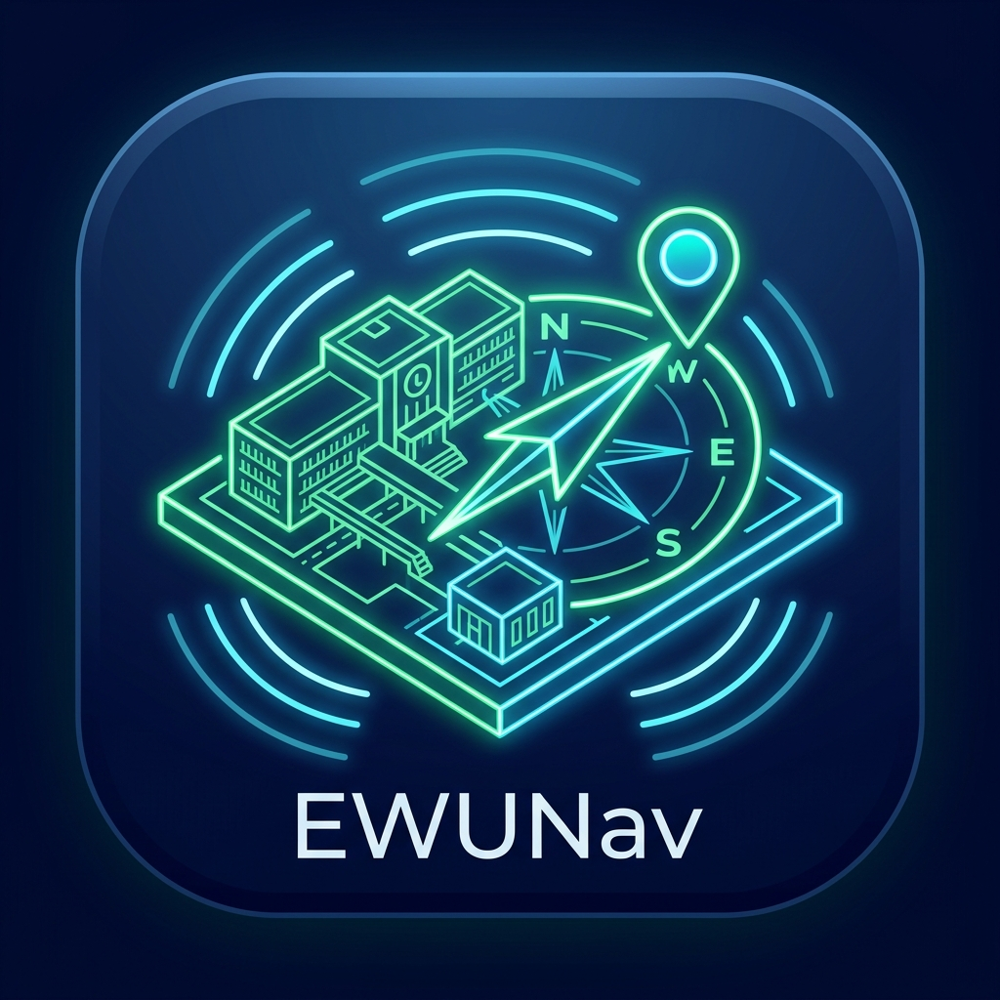

# EWUNav Surveyor 2.0: Industry-Standard SLAM & IMDF Mapping Suite



**EWUNav Surveyor** is an enterprise-grade, autonomous indoor mapping and SLAM (Simultaneous Localization and Mapping) surveying suite built with Flutter. Designed for the East West University campus but scalable to any venue, it allows field operators to generate **OGC IMDF (Indoor Mapping Data Format)** and **GeoJSON** blueprints entirely on-device using zero-hardware Pedestrian Dead Reckoning (PDR).

## 🚀 Key Capabilities

### 📍 Zero-Hardware PDR & SLAM
- **Dynamic Weinberg Stride Calibration:** Accurately measures and persists per-user step lengths.
- **Barometric Altitude Tracking:** Detects floor transitions using high-precision pressure drop telemetry (`environment_sensors`).
- **Compass Fusion with Baseline Anchoring:** Locks device heading to the true north architectural baseline of the building.
- **Multi-Pass Snapping:** Intelligently snaps intersecting paths within a 1.5m radius to generate clean, unified centerlines.
- **Coverage Heatmaps:** Renders real-time 2x2m surveyor density overlays directly on the canvas.

### ♿ ADA & Wheelchair Accessibility First
EWUNav Surveyor guarantees safe routing for users with disabilities by embedding ADA parameters directly into the graph:
- **Corridor Edges:** `runningSlopePercent`, `crossSlopePercent`, `widthMeters`, and `tactilePaving`.
- **Openings (Doors):** `clearWidthMeters`, `thresholdHeightMm`, and `doorMechanism`.
- **Wheelchair Routing:** The multi-floor Dijkstra algorithm strictly bypasses slopes > 8.33% and non-compliant doorframes.

### 🏢 OGC IMDF Architecture
EWUNav aligns its data model strictly with the **Apple Indoor Survey** and **OGC IMDF v1.0.0** specifications:
- **27+ Standardized Room Categories** (Atrium, RestroomMale, ServerRoom, Walkway, etc.).
- **Amenities & Openings:** Distinct models for POIs and Portals.
- **Zip Archive Compiler:** The built-in `ExportManager` generates `venue.geojson`, `level.geojson`, and `unit.geojson` directly into an IMDF `.zip` file for immediate native sharing via `share_plus`.

## 🛠️ Architecture & Tech Stack

- **Framework:** Flutter SDK >= 3.13.4
- **Persistence:** SQLite (`sqflite`) with atomic `SurveyRepository` pattern and v3 schema migrations.
- **Sensor Fusion:** Accelerometer, Gyroscope, Magnetometer, Barometer.
- **Testing:** 100% core logic coverage (`flutter_test`).

## 🏗️ Getting Started

### Prerequisites
- Android physical device (Emulator sensors are insufficient for SLAM/PDR).
- Location & Wi-Fi Scanning Permissions (for GPS anchoring and BSSID fingerprinting).

### Installation
```bash
git clone https://github.com/rxxeron/ewunavsurvey.git
cd ewunavsurvey/ewunav
flutter pub get
```

### Build & Run
```bash
# Debug Mode
flutter run

# Release APK (Recommended for accurate sensor telemetry)
flutter build apk --release
```

## 🧪 Testing
The architecture is rigorously tested. To run the suite:
```bash
flutter test
```
*Current Coverage includes Multi-Floor Routing, ADA Slopes, Compass Snapping, BleFingerprints, and AreaZone Shoelace calculations.*

## 📜 Database Schema (v3)
- `imdf_metadata`: Venue properties and building hierarchy.
- `rooms`: Points of Interest and 27+ IMDF units.
- `edges`: SLAM trajectory graph containing path coordinates and ADA constraints.
- `openings`: Doorways and portals with clearance metadata.
- `amenities`: POIs like Fire Extinguishers and Escalators.
- `area_zones`: Shoelace polygon coordinate representations for drawn zones.
- `wifi_fingerprints` & `ble_fingerprints`: Attenuation-logged RF signals for localization.

## 🤝 Contributing
Please run `flutter analyze` and ensure all `flutter test` suites pass before opening PRs. 

---
*Built for East West University Campus Navigation.*
